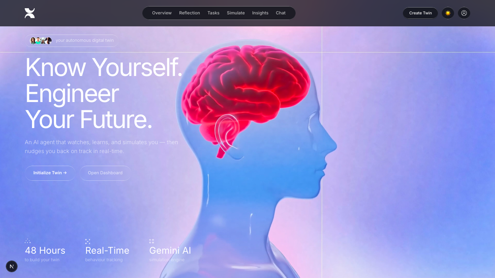
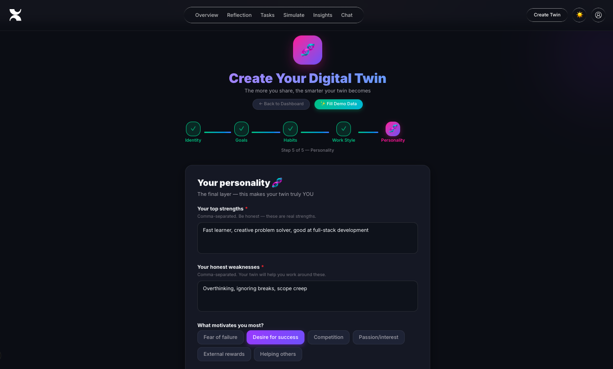
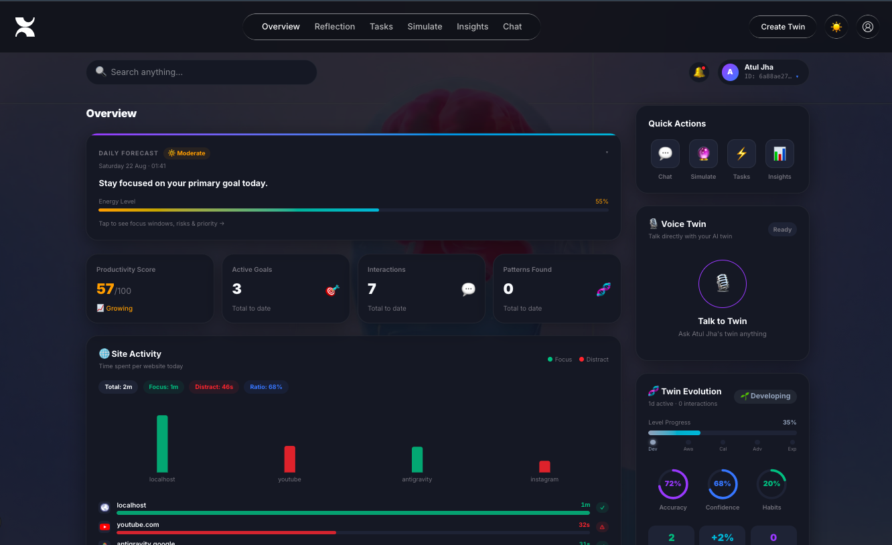
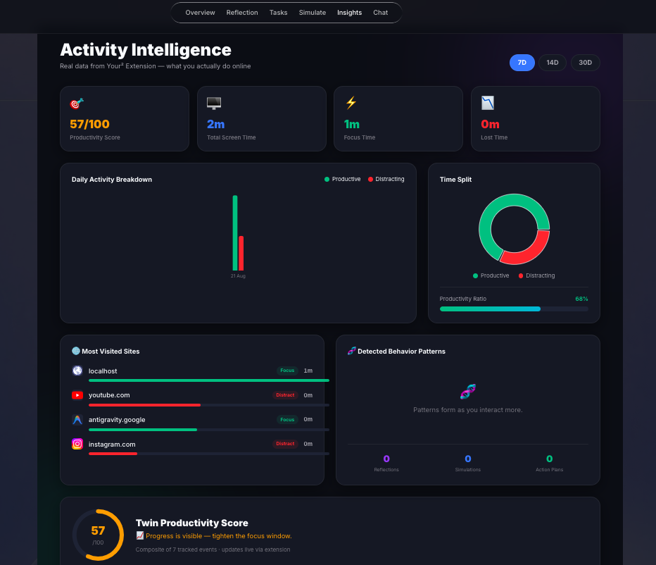

# You² — Autonomous Digital Twin Agent 🧠⚡

> **Stop guessing. Start operating with your second self.**

You² is an **AI-powered Autonomous Digital Twin Agent** that learns how you think, work, focus, prioritize, procrastinate, and make decisions — then actively helps you execute goals in real time.

Built as an advanced, autonomous AI agent that deeply understands your behavioral patterns to maximize productivity.

---

## 🌍 The Vision

Most productivity tools require manual input. You² is different. 
By running silently as a browser extension, it observes your daily digital habits, builds a sophisticated "Digital Twin" profile using LLMs, and intervenes *autonomously* when you stray from your goals.

It doesn't just track time; it understands context, intent, and your personal psychology to deliver the right nudge at the right moment.

## ✨ Key Features

- **🧠 Deep Behavioral Profiling**: Learns your work style, procrastination triggers, strengths, and weaknesses through initial onboarding and continuous observation.
- **👁️ Real-Time Distraction Detection**: The smart browser extension categorizes sites locally and calculates productivity scores in real-time.
- **⚡ Autonomous Interventions**: 
  - **15-Second Intent Check**: If you visit a highly distracting site, the agent immediately halts you with a sleek 15-second countdown overlay, forcing you to justify your visit or automatically closing the tab.
  - **Escalating Nudges**: If you stay distracted, the agent issues progressively stronger alerts (15m, 30m, 45m) and eventually forces a tab close.
- **🤖 Talk to your Twin**: Chat directly with your digital twin to simulate scenarios, get advice tailored to your psychology, or ask it to generate optimized schedules.
- **🔮 Predictive Simulations**: Run "what-if" scenarios (Best Case, Likely Case, Worst Case) based on your current trajectory and habits.
- **📊 Real-time Dashboard**: A stunning, glassmorphism-inspired UI featuring dark/light modes, live activity tracking, and dynamic insights into your productivity ratio.
- **🎨 Custom Aesthetic UI**: A highly polished, custom-built interface featuring liquid-glass styling, dynamic background videos, and a unique neural-network cursor that creates an immersive experience.
- **🧠 Permanent Agent Widget**: A floating neural-status icon on every site — green for productive, red for distracting — with a click-to-expand panel showing AI analysis, advantages/disadvantages, and safe usage time.

---

## 📸 Screenshots

<table>
  <tr>
    <td align="center"><b>🏠 Landing Page</b></td>
    <td align="center"><b>📊 Live Dashboard</b></td>
  </tr>
  <tr>
    <td></td>
    <td></td>
  </tr>
  <tr>
    <td align="center"><b>📈 Activity Intelligence</b></td>
    <td align="center"><b>🧬 Create Your Twin</b></td>
  </tr>
  <tr>
    <td></td>
    <td></td>
  </tr>
</table>

---

# 🧬 Core Intelligence Modules

---

# 1️⃣ Digital Twin Engine

The heart of You².

Creates a behavioral model of the user and continuously improves it.

## Learns:

- how you think  
- when you perform best  
- what triggers procrastination  
- how you make decisions  
- how long tasks realistically take  
- what motivates you  
- where time gets wasted  

## Result:

Every recommendation becomes context-aware and personal.

---

# 2️⃣ AI Twin Chat

Talk to your second self.

Ask real questions and receive strategic responses based on your behavior.

## Example Prompts

- What should I focus on today?
- Why am I procrastinating lately?
- Should I do DSA or build projects?
- Reorder my tasks by importance.
- Give me honest motivation.
- Help me stop wasting time.
- What would the best version of me do now?

## Why It’s Different

Most AI chats give generic answers.

You² uses:

- your goals  
- your habits  
- your performance data  
- your current schedule  

---

# 3️⃣ Smart Focus Agent

A proactive AI that protects your attention.

## Example Flow

| Time on Distracting Website | AI Action |
|----------------------------|----------|
| 15 minutes | Gentle reminder |
| 30 minutes | Strong warning |
| 45 minutes | Countdown popup |
| 60 minutes | Auto-close tab / redirect |

## Example Messages

> “You planned to focus today. Return to your mission?”

> “Pattern detected: 3 distractions today.”

## Supported Actions

- close distracting tabs  
- mute entertainment tabs  
- redirect to LeetCode  
- open planner dashboard  
- start focus timer  

---

# 4️⃣ Task Execution Agent

You² does not just remind you.

It helps you complete tasks.

## Example User Tasks

- Watch DSA Arrays playlist  
- Solve 3 LeetCode questions  
- Read Striver notes  
- Give mock interview  
- Apply to internships  
- Update LinkedIn profile  
- Revise DBMS  
- Build portfolio site  

## What You² Does

✅ Prioritizes tasks  
✅ Converts tasks into missions  
✅ Opens correct resources automatically  
✅ Starts timers  
✅ Launches next task after completion  
✅ Tracks progress  
✅ Replans if delayed  

---

# 5️⃣ Adaptive Planner

If life changes, the plan changes.

## Example

> “You skipped 2 tasks. Re-optimizing your remaining day.”

The planner dynamically rebuilds your schedule based on:

- time remaining  
- missed tasks  
- energy level  
- deadlines  
- productivity trends  

---

# 6️⃣ Productivity Analytics

You² helps users understand themselves.

## Dashboard Metrics

- Focus Score  
- Productive Hours  
- Distraction Time  
- Rescue Sessions  
- Task Completion Rate  
- Deep Work Sessions  
- Weekly Growth Trend  
- Best Working Hours  

---

# 🌐 Chrome Extension Companion

A real-time execution layer inside the browser.

The extension transforms You² from a web app into an active AI agent.

---

## Features

### 🔍 Smart Site Classification

Automatically detects:

- productive sites  
- distracting sites  
- neutral sites  
- sensitive/private sites  

### 🎯 Focus Nudges

Warns when attention drifts.

### ⚡ Instant Task Launching

Click a mission card:

- opens LeetCode  
- opens HackerRank  
- opens YouTube playlist  
- opens LinkedIn Jobs  
- opens Notes / Docs  

### 🛡️ Safe Mode

Sensitive sites are ignored automatically.

---

# 🔐 Privacy First

Trust matters.

You² is built with privacy controls.

## Automatically Ignored

- Banking sites  
- Payment gateways  
- Healthcare portals  
- Government sites  
- Authentication pages  
- Private dashboards  

## Never Collected

- passwords  
- OTPs  
- card numbers  
- secure form values  
- keystrokes  

## Philosophy

> Assist productivity, never invade privacy.

---

# 🏗️ System Architecture

```bash
you2/
├── client/       # Next.js Frontend
├── server/       # Node.js + Express Backend
└── extension/    # Chrome Extension (Manifest V3)
```
# 🛠️ Tech Stack

| Layer | Stack |
|------|------|
| Frontend | Next.js, React, TypeScript |
| Styling | Tailwind CSS, Framer Motion |
| Backend | Node.js, Express |
| Database | MongoDB |
| AI Engine | Google Gemini API |
| Browser Agent | Chrome Extension Manifest V3 |
| Charts | Recharts |

---

# 🎨 Frontend Experience

Designed to feel like:

> **Your consciousness became software.**

## UI Style

- dark cinematic theme  
- glassmorphism panels  
- premium typography  
- neural glowing effects  
- animated orb twin avatar  
- futuristic dashboard  
- startup-grade polish  

---

# ⚙️ How It Works

## Step 1 — Create Your Twin

User answers onboarding questions:

- goals  
- strengths  
- habits  
- distractions  
- priorities  
- personality style  

## Step 2 — Twin Learns

Gemini creates a dynamic behavioral profile.

## Step 3 — Agent Activates

You² starts:

- planning  
- tracking  
- warning  
- redirecting  
- executing  
- optimizing  

---

# 🎬 Judge Demo Flow

1. Open app  
2. Create digital twin  
3. Add 10 tasks  
4. AI prioritizes missions  
5. Click START  
6. Task launches automatically  
7. Open YouTube distraction tab  
8. Warning popup appears  
9. Ignore warning  
10. Tab auto-closes  
11. Dashboard shows analytics  

---

# 📁 Important Pages

```bash
client/app/
├── page.tsx              # Landing page
├── dashboard/page.tsx    # Main dashboard
├── chat/page.tsx         # AI Twin Chat
├── planner/page.tsx      # Adaptive planner
├── analytics/page.tsx    # Productivity insights
├── tasks/page.tsx        # Mission center
```
# 🧠 Why This Matters

Most AI tools answer.  

**You² acts.**

Most tools react.  

**You² anticipates.**

Most tools are generic.  
---

# 🤖 Agentic Autonomous Extensions

You² includes lightweight, non-intrusive agentic capabilities in the extension:

1. **One-Click Context Switcher & Auto-Prep**:
   - Stages workspace environment instantly (opens LeetCode + Notion in an organized browser Tab Group).
   - Mutes noise tabs (Gmail, Discord, YouTube).
   - Pre-loads starter boilerplates or code snippets into your system clipboard.

2. **Smart Friction Creator (Micro-Obstacles)**:
   - Actively disrupts mindless dopamine scrolling on distracting sites.
   - **Typing Verification**: Requires manual typing of a daily sacrifice statement (*"I am sacrificing 30 minutes of project work right now"*).
   - **Micro-Quiz Gatekeeper**: Asks a quick mental math question before unlocking entertainment tabs.

3. **Auto-Save & Clean Up Agent**:
   - **Tab Stash**: Safely archives idle tabs into local storage to free browser RAM.
   - **Session Snapshots**: Captures research tab states under a tagged project session (*e.g., "DSA Sprint"*) for quick retrieval.

---

# 🚀 Future Roadmap

- AI twin negotiates meetings automatically  
- Twin manages email workflows  
- Twin predicts burnout early  
- Twin builds custom study schedules  
- Twin becomes cross-device memory system  
- Twin becomes full personal operating system  

---

# 🏆 Built For

**MLH Bot-to-Agent Hackathon 2026**

---

# 🤝 Contributing

Ideas, feedback, and collaborations are welcome.

---

# 📄 License

MIT License

---

# ✨ Final Statement

> You² is not another chatbot.  
> It is the beginning of personal autonomous intelligence.
